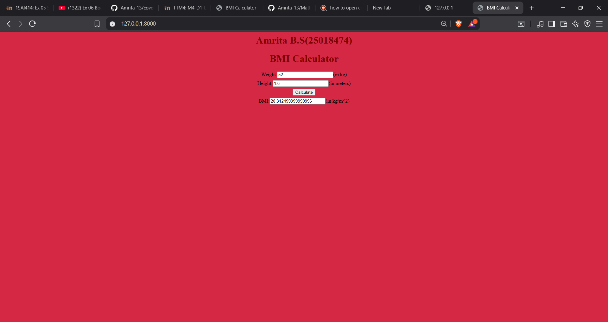
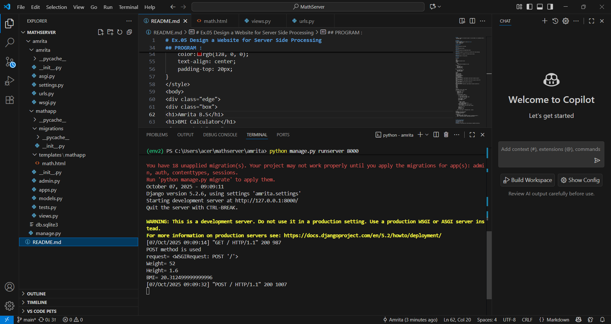

# Ex.05 Design a Website for Server Side Processing
## Date:6.10.2025

## AIM:
 To design a website to calculate the power of a lamp filament in an incandescent bulb in the server side. 


## FORMULA:
BMI = W/H<sup>2</sup>
<br> BMI --> Body Mass Index (in kg/m<sup>2</sup>)
<br> W --> Weight(in kg)
<br> H --> Height(in m)

## DESIGN STEPS:

### Step 1:
Clone the repository from GitHub.

### Step 2:
Create Django Admin project.

### Step 3:
Create a New App under the Django Admin project.

### Step 4:
Create python programs for views and urls to perform server side processing.

### Step 5:
Create a HTML file to implement form based input and output.

### Step 6:
Publish the website in the given URL.

## PROGRAM :
```
math.html

<html> 
<head> 
<title>BMI Calculator</title> 
</head> 
<style>

    body{
       background-color:rgb(213, 40, 69);
}
.formelt{
    color:black;
    text-align: center;
    margin-top: 7px;
    margin-bottom: 6px;
}
h1{
    color:rgb(128, 0, 0);
    text-align: center;
    padding-top: 20px;
}
</style>
<body>
<div class="edge"> 
<div class="box"> 
<h1>BMI Calculator</h1> 
<form method="POST">

<div class="formelt"> 
Weight:<input type="text" name="weight" value="{{w}}"></input>(in kg)<br/> 
</div> 
<div class="formelt"> 
Height:<input type="text" name="height" value="{{h}}"></input>(in meters)<br/> 
</div> 
<div class="formelt"> 
<input type="submit" value="Calculate"></input><br/> 
</div> 
<div class="formelt"> 
BMI:<input type="text" name="bmi" value="{{bmi}}"></input>(in kg/m^2)<br/> 
</div>
</form>
</div>
</div> 
</body>
</html>

views.py
from django.shortcuts import render 

def bmi_calculator(request): 
    context = {} 
    context['bmi'] = "0" 
    context['w'] = "0" 
    context['h'] = "0" 
    
    if request.method == 'POST': 
        print("POST method is used")
        
        w = request.POST.get('weight', '0')
        h = request.POST.get('height', '0')
        
        print('request=', request) 
        print('Weight=', w) 
        print('Height=', h) 
       
        try:
            weight = float(w)
            height = float(h)
            bmi = weight / (height ** 2)
        except ZeroDivisionError:
            bmi = "Invalid height (cannot be zero)"
        except ValueError:
            bmi = "Invalid input (enter numeric values)"
        
        context['bmi'] = bmi 
        context['w'] = w
        context['h'] = h 
        print('BMI=', bmi) 
    
    return render(request, 'mathapp/math.html', context)

urls.py
from django.contrib import admin 
from django.urls import path 
from mathapp import views 

urlpatterns = [ 
    path('admin/', admin.site.urls), 
    path('bmicalculator/', views.bmi_calculator, name="bmicalculator"),
    path('', views.bmi_calculator, name="bmicalculatorroot")
]


```

## SERVER SIDE PROCESSING:

## HOMEPAGE:

## RESULT:
The program for performing server side processing is completed successfully.
